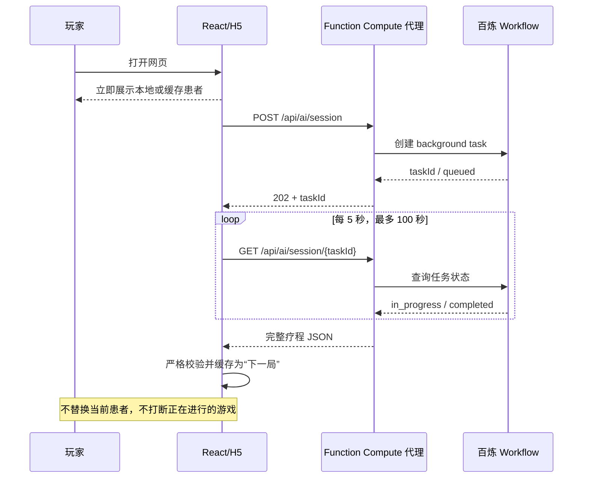
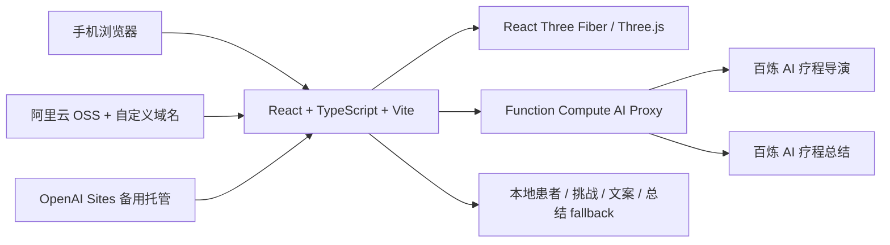

# 《一针见血？》 / Needle Roulette

一个面向手机浏览器的 3D 趣味互动小游戏：旋转手部模型、寻找目标穴位、完成五次下针，并观察不同落点触发的夸张视觉、声音、患者状态与 AI 剧情反馈。

> [!IMPORTANT]
> 本项目是娱乐游戏与交互技术 Demo，不是医学训练、诊断、治疗或真实针灸操作指导。游戏中的判定、概率、分数、3D 坐标和视觉效果均为玩法设计，不能用于现实医疗决策。

## 在线体验

- 中国大陆正式站：[https://rongmomo.lyshowcase.com/](https://rongmomo.lyshowcase.com/)
- 备用演示站：[https://needle-roulette-demo.zaixiaxuexibjt.chatgpt.site/](https://needle-roulette-demo.zaixiaxuexibjt.chatgpt.site/)
- GitHub：[https://github.com/ly-tt/RongMoMo](https://github.com/ly-tt/RongMoMo)

建议使用手机竖屏浏览器访问，并开启声音与振动权限以获得完整反馈。
备用站未配置百炼服务端环境变量时会自动使用本地 fallback，完整 AI 流程以中国大陆正式站为准。

## 项目亮点

- **移动端 3D 交互**：React Three Fiber 驱动手部模型，支持单指旋转、双指缩放和表面点击检测。
- **五针连续疗程**：每针都会累积疼痛、青紫、出血、麻木与信任状态，而不是五次相互独立的判定。
- **两种游戏模式**：简单版轻触下针；挑战版通过长按蓄针与稳定窗口影响结果。
- **多层结果系统**：五类基础结果进一步细分为得气、血点、血肿、窜电、持续麻木、晕针、滞针等趣味事件。
- **夸张反馈**：粒子、闪光、镜头冲击、手部抖动、淤青扩散、出血效果、合成音效与设备振动共同反馈结果。
- **AI 疗程导演**：百炼 Workflow 生成患者、挑战、五类对白库与第三针中场事件。
- **AI 异步预取**：当前局立即可玩，AI 在后台生成下一局，不会在生成完成后突然替换正在显示的患者。
- **AI 疗程总结**：五针结束后，根据患者、最终状态和实际记录生成简短评价与分享图文案。
- **安全降级**：百炼不可用、超时、格式错误或连续生成重复患者时，游戏自动使用本地患者、挑战、对白与总结。

## 游戏流程

```text
打开网页
   ↓
立即展示本地或缓存患者，同时后台准备下一局 AI 疗程
   ↓
选择简单版 / 挑战版
   ↓
根据穴位提示旋转 3D 手部并下针
   ↓
结合落点距离、手心/手背、侧面方向和蓄针稳定度判定结果
   ↓
播放视觉、声音、振动和患者对白
   ↓
更新连续疗程状态并进入下一针
   ↓
五针结束，生成本地或 AI 疗程总结与分享图片
```

## 游戏机制

### 两种模式

| 模式 | 操作 | 定位 |
| --- | --- | --- |
| 简单版 | 轻触目标位置下针 | 适合首次体验，重点观察穴位与反馈 |
| 挑战版 | 按住蓄针，在稳定窗口松手 | 稳定度会参与距离修正和事件概率计算 |

### 五类基础结果

| 结果 | 游戏含义 | 主要反馈 |
| --- | --- | --- |
| `SUCCESS` | 命中当前模型目标 | 绿色光圈、粒子、得气提示、信任增加 |
| `BLOOD` | 进入虚构浅表血管事件区 | 红色液滴与喷射、屏幕冲击、出血累积 |
| `NERVE` | 进入虚构神经敏感区 | 电流、闪光、手抖、麻木累积 |
| `BRUISE` | 进入软组织偏差区 | 贴合手部的淤青扩散、青紫累积 |
| `BONE` | 进入硬组织事件区 | 针体回弹、撞击音、强烈触感提示 |

基础结果还会结合稳定度、患者血管难度、疗程压力和随机种子，细分为 11 种反应：

```text
酸麻得气 / 针点酸痛 / 冒出血点 / 血肿扩张 / 短暂窜电
持续麻木 / 突然晕针 / 针体滞住 / 局部瘀点 / 大片青紫 / 硬组织回弹
```

这些反应只用于娱乐反馈和安全科普，不代表真实操作结果。

### 连续患者状态

```ts
type PatientState = {
  pain: number
  bruise: number
  bleeding: number
  numb: number
  trust: number
  needleCount: number
}
```

每次下针都会改变多项状态。当前状态会进一步影响疗程压力、患者对白、异常事件概率、挑战进度和最终总结。

### 穴位内容

当前版本包含 10 个手部穴位：

```text
合谷 LI4 / 劳宫 PC8 / 少府 HT8 / 鱼际 LU10 / 后溪 SI3
中渚 TE3 / 阳池 TE4 / 神门 HT7 / 大陵 PC7 / 太渊 LU9
```

每个穴位提供所属经脉、标准位置简述和面向普通玩家的快速找法。文案依据与 3D 定点限制详见 [docs/acupoint-content.md](docs/acupoint-content.md)。

当前 GLB 是动画拓扑练习模型，不是医学标本，缺少可查询的掌骨、肌腱和腕横纹 landmark。标准文字与模型坐标必须分开理解，现有标记不能用于专业取穴。

## AI 设计

### 百炼应用

| 能力 | 应用 | 应用 ID | 状态 |
| --- | --- | --- | --- |
| AI 疗程导演 | 患者、挑战、对白库、中场事件 | `6784c6239a3048208ecd4f9ab1d79ebe` | 当前主流程 |
| AI 疗程总结 | 五针结束后的评价、患者对白、分享文案 | `5335c37d57f94cae8324356af5117176` | 当前主流程 |
| 旧患者生成器 | 只生成患者资料 | `78d7b6cfd1c3480a950bb9a1f38e3afc` | 保留用于回滚 |

应用 ID 不是 API Key，可以出现在前端文档中；`DASHSCOPE_API_KEY` 只能保存在服务端环境变量中。

### AI 疗程导演输出

```ts
type AiTreatmentSession = {
  patient: {
    name: string
    age: number
    painTolerance: number
    vascularDifficulty: number
    personality: string
    openingDialog: string
  }
  challenge: {
    code: 'KEEP_TRUST' | 'LIMIT_PAIN' | 'LIMIT_BLEEDING' | 'HIT_COUNT'
    target: number
    title: string
    description: string
    successText: string
    failText: string
  }
  dialogueBank: Record<'SUCCESS' | 'BLOOD' | 'NERVE' | 'BRUISE' | 'BONE', [string, string]>
  midpointEvent: {
    triggerNeedle: 3
    mood: 'CALM' | 'NERVOUS' | 'IMPRESSED' | 'SUSPICIOUS'
    screenEffect: 'NONE' | 'HEARTBEAT' | 'COLD_FLASH' | 'WARM_GLOW'
    dialog: string
  }
}
```

当前推荐的大模型节点配置：

```text
模型：Qwen-Flash
最大回复 Token：1024
top_p：0.80
temperature：0.40
enable_thinking：显式关闭
thinking_budget：不传递
result_format：message
enable_search：关闭
记忆：关闭
```

关闭思考模式后，一次真实测试从约 78.7 秒下降到约 6.6 秒。该数据只代表当次网络与服务状态，不是延迟承诺。

### 异步预取与去重



- 可用疗程缓存在浏览器 `localStorage`，有效期 24 小时。
- 第一份 AI 患者与最近历史重复时，后台自动再生成一次。
- 第二次仍重复、结构不合法或超时，则放弃缓存，保留本地降级方案。
- AI 总结失败时只影响总结文案，不影响五针游戏流程。

## 技术架构



### 前端

- React 19
- TypeScript 5.9
- Vite 7
- React Three Fiber 9
- Drei 10
- Three.js 0.180
- Web Audio API
- Vibration API（浏览器支持时启用）

### 云端

- 阿里云百炼 Workflow / Qwen-Flash
- 阿里云 Function Compute：隐藏 API Key、转发与校验 AI 请求
- 阿里云 OSS：正式站静态资源托管
- 自定义域名与 HTTPS：`rongmomo.lyshowcase.com`
- OpenAI Sites：备用公开演示站

## 安全与可靠性

服务端代理位于 [functions/bailian-proxy](functions/bailian-proxy)，包括：

- API Key 仅存储在服务端，不进入 Vite 前端包。
- CORS 只允许配置的正式站 Origin。
- 单 IP 请求限流。
- 24 KB 请求体限制。
- 上游请求超时控制。
- 患者、挑战、对白和总结的严格字段与数值范围校验。
- 模型 Markdown 代码块清理与 JSON 解析。
- 结构化 `requestId` 日志，便于在 Function Compute 中追踪失败请求。
- 本地患者、挑战、对白与总结 fallback。
- `DEBUG_AI_OUTPUT` 默认关闭，避免长期记录生成内容。

公开 Demo 不处理登录、支付或用户隐私数据，也不使用数据库。

## 项目结构

```text
RongMoMo/
├─ public/
│  ├─ models/hand.glb          # 手部 GLB
│  └─ og.png                   # 分享预览图
├─ src/
│  ├─ App.tsx                  # 页面、3D 场景、下针与疗程主流程
│  ├─ styles.css               # 移动端界面与反馈动画
│  ├─ main.tsx                 # React 入口
│  ├─ game/
│  │  ├─ needleReaction.ts     # 11 种细分反应
│  │  └─ patientChallenge.ts   # 本地挑战与患者对白 fallback
│  └─ services/
│     └─ aiService.ts          # AI 请求、异步轮询、校验、缓存与去重
├─ functions/bailian-proxy/
│  ├─ server.js                # Function Compute Web Function
│  ├─ test.mjs                 # 代理基础测试
│  └─ README.md                # 函数部署与日志说明
├─ workers/sites-worker.js     # Sites 运行时代理
├─ docs/
│  ├─ acupoint-content.md      # 穴位文案依据与定点限制
│  └─ bailian-patient-workflow.md
├─ scripts/prepare-sites.mjs   # 准备 Sites Worker 构建产物
├─ .openai/hosting.json        # Sites 项目标识
├─ .env.example                # 环境变量示例
└─ package.json
```

## 本地开发

### 环境要求

- Node.js 20 或更高版本
- npm
- 支持 WebGL 的现代浏览器

### 启动前端

```bash
git clone https://github.com/ly-tt/RongMoMo.git
cd RongMoMo
npm install
npm run dev
```

浏览器打开 Vite 输出的本地地址，通常为：

```text
http://localhost:5173/
```

手机与电脑处于同一局域网时，可以打开终端输出的 `Network` 地址，例如：

```text
http://192.168.x.x:5173/
```

直接双击 `index.html` 不会启动 Vite，也无法正确加载模块和开发资源。

### 本地 AI 联调

前端和 AI 代理跨域运行时，在项目根目录创建 `.env.local`：

```text
VITE_AI_API_BASE_URL=http://localhost:9000
```

然后在另一个终端启动代理。PowerShell 示例：

```powershell
cd functions/bailian-proxy
$env:DASHSCOPE_API_KEY="你的百炼 API Key"
$env:ALLOWED_ORIGIN="http://localhost:5173"
npm start
```

不要把 API Key 写入任何以 `VITE_` 开头的变量；这类变量会被打包进浏览器代码。

如果不启动本地代理，游戏仍可使用本地 fallback 运行，但不会获得新的百炼疗程和总结。

## 构建与测试

```bash
# TypeScript 检查 + Sites 生产构建
npm run build

# 阿里云 OSS 静态构建
npm run build:oss

# 本地预览生产构建
npm run preview

# Function Compute 代理基础测试
cd functions/bailian-proxy
npm test
```

构建产物：

- `dist/`：Sites 构建及 Worker 入口。
- `dist-oss/`：阿里云 OSS 静态网站文件。

## API

| 方法 | 路径 | 说明 |
| --- | --- | --- |
| `GET` | `/health` | 检查代理与 AI Key 配置状态 |
| `POST` | `/api/ai/session` | 创建 AI 疗程导演异步任务，返回 `202 + taskId` |
| `GET` | `/api/ai/session/{taskId}` | 查询任务；处理中返回 202，完成后返回疗程 JSON |
| `POST` | `/api/ai/patient` | 旧患者 Workflow，保留用于回滚 |
| `POST` | `/api/ai/report` | 根据患者、最终状态和五针记录生成总结 |

更完整的函数配置、环境变量和日志说明见 [functions/bailian-proxy/README.md](functions/bailian-proxy/README.md)。

## 部署

### 阿里云 OSS 正式站

1. 在 `.env.oss` 中配置公开的函数地址：

   ```text
   VITE_AI_API_BASE_URL=https://你的函数公网域名
   ```

2. 运行：

   ```bash
   npm run build:oss
   ```

3. 将 `dist-oss/` 内的全部内容上传到 Bucket 根目录，而不是上传外层目录。
4. 静态网站首页设置为 `index.html`。
5. 配置自定义域名、CDN/证书与 HTTPS。
6. 更新后如果仍显示旧资源，清理 CDN/浏览器缓存或使用无痕窗口验证。

### Function Compute AI 代理

建议设置：

```text
Runtime：Node.js 20 / Custom Runtime
启动命令：npm start
监听端口：9000
公网访问：启用
请求方法：GET, POST, OPTIONS
```

必须配置：

```text
DASHSCOPE_API_KEY=<只放在函数环境变量中>
BAILIAN_PATIENT_APP_ID=78d7b6cfd1c3480a950bb9a1f38e3afc
BAILIAN_SESSION_APP_ID=6784c6239a3048208ecd4f9ab1d79ebe
BAILIAN_REPORT_APP_ID=5335c37d57f94cae8324356af5117176
ALLOWED_ORIGIN=https://rongmomo.lyshowcase.com
DEBUG_AI_OUTPUT=false
```

可选：

```text
DASHSCOPE_WORKSPACE_ID=<非默认百炼 Workspace ID>
```

### OpenAI Sites 备用站

`npm run build` 会生成 Sites 所需的 `dist/server/index.js`，项目标识保存在 `.openai/hosting.json`。备用站使用现有 Sites 项目发布。

## 调试

### 页面空白

- 不要直接双击 `index.html`；使用 `npm run dev`。
- 检查终端是否显示 Vite `ready`。
- 检查浏览器 Console 是否存在模型 404、WebGL 或跨域错误。
- 确认 `public/models/hand.glb` 存在。

### AI 一直使用本地患者

- 请求 `/health`，确认返回 `aiConfigured: true`。
- 检查 Function Compute 的 `DASHSCOPE_API_KEY` 和三个应用 ID。
- 确认 Workflow 修改后已重新发布，而不只是保存草稿。
- 检查 `ALLOWED_ORIGIN` 是否与网页 Origin 完全一致。
- 查看 Function Compute 中同一 `requestId` 的 `request_started`、`request_completed` 或 `request_failed` 日志。

### AI 很慢

- 确认 Qwen-Flash 的 `enable_thinking` 被明确设置为关闭。
- 不传递 `thinking_budget`。
- 保持记忆、联网搜索和不必要的插件关闭。
- 查看百炼 Trace，区分排队、模型生成和其他 Workflow 节点耗时。
- 当前前端会异步预取，因此 AI 变慢不会锁住首页或当前游戏。

### OSS 返回 `NoSuchKey`

- 确认 `index.html` 位于 Bucket 根目录。
- 确认上传的是 `dist-oss/` 的内容，而不是 `dist-oss` 文件夹本身。
- 配置静态网站默认首页，并检查自定义域名是否绑定到正确 Bucket。

## 截图


## 3D 模型来源

手部模型基于 Sketchfab 的 [Hand Topology Study](https://sketchfab.com/3d-models/hand-topology-study-de4f151a05494152b4c213ccafc4f646)，作者 [Johnson Martin](https://sketchfab.com/Johnson-Martin)。项目对模型的场景选择、材质颜色、中心点、分区识别和 Web 交互进行了适配。

模型描述中作者表示下载内容可按 CC0 使用，但 Sketchfab 页面当前的许可证字段显示为 **Creative Commons Attribution**。本项目采用更保守的方式保留作者、作品链接与出处说明。再次分发或用于其他项目时，请自行核对下载时附带的许可证文件和 Sketchfab 最新页面信息。

非常感谢这位作者

## 已知限制

- 手部模型和穴位坐标不是医学级数据。
- 穴位文字基于标准资料整理，但快速找法与 3D marker 仅用于游戏提示。
- 侧面、掌心和手背判定依赖当前模型法线与手工坐标，替换 GLB 后必须重新校准。
- AI 输出具有随机性，仍可能出现重复、格式错误或服务不可用，因此始终保留本地 fallback。
- 首次加载需要下载 3D 模型和较大的 Three.js 前端包，弱网设备可能等待更久。
- Web Audio、振动和分享图片下载能力受浏览器兼容性限制。

## 不在范围内

本项目有意不开发：

```text
登录 / 用户系统 / 排行榜 / 后台管理 / 数据库
医学级血管模型 / VR / 多人联机 / App 安装包
```

## 作者

- GitHub：[@ly-tt](https://github.com/ly-tt)
- 项目：[`ly-tt/RongMoMo`](https://github.com/ly-tt/RongMoMo)

## 许可证

当前仓库尚未提供项目源码的 `LICENSE` 文件，因此不能默认视为 MIT 或其他开源许可证。若后续希望允许他人复制、修改或再发布源码，应单独添加明确的许可证文件。

第三方 3D 模型及其他资源遵循各自的许可证与署名要求，不因本仓库的源码许可证而改变。
